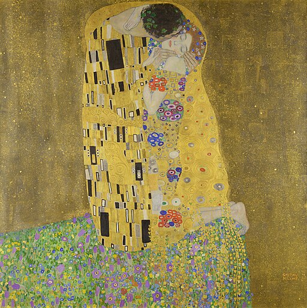
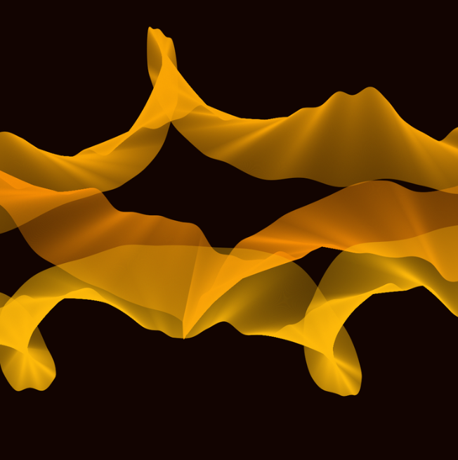

# Creative_Coding_Major_Project_rxio0223

## 1. Interact with the Work
When the page loads, all animations begin automatically — including drifting clouds and mist, shimmering gold dust, flowing wind lines, and the gentle sway of branches.  
Apples will remain on the tree for about **two seconds** before falling on their own, pausing briefly on the ground, and then returning to the tree in a continuous loop.

No user input is required to enjoy the full animation.  
However, you can **press the Spacebar** to switch the direction of gravity, causing the apples to fall upward or downward. When gravity changes, all apples reset and restart their motion.  
The canvas will automatically adapt to the size of the browser window.

---

## 2. Details of the Approach

### 2.1 Animation Driver
The system uses **Perlin noise**, combining noise values, random values, and random seeds to drive all dynamic elements.

### 2.2 Animated Properties
- **Cloud Background**  
  The sky background is formed using layered Perlin-noise-based cloud textures. As time progresses, `noise() + t` produces a slow drifting effect.

- **Gold Powder Layer**  
  Randomly generated particles create a subtle twinkling sheen, enhancing visual richness.

- **Wind Flow Lines**  
  Wind is constructed by linking moving points influenced by Perlin noise and Bézier curves.  
  Multiple layers of these curves, combined with slight distortion from `sin()`, produce a soft, continuous flowing-wind effect.


### 2.3 Inspiration References


#### 2.3.1 Gold Dust
Shimmering gold dust inspiration comes from Gustav Klimt's "The Kiss," with the scene filled with shimmering golden patterns and inlaid decorations. The lovers are entwined within golden robes, the gold leaf surface subtly sparkling under light, giving the entire painting a luxurious glow and mysterious atmosphere, adding delicate light and shadow and a sense of motion even in the static image.



#### 2.3.2 Wind
The inspiration for the Wind comes from the clouds, moon, and starlight in Vincent van Gogh's "Starry Night" (1889) painting, which uses curved, wavy brushstrokes to form streams of energy flow, suggesting movement and rhythm.


Amy Goodchild's twisted ribbon Bézier curve technique provides the technical foundation for this creation: by overlaying noise to move curve control points, the lines become soft, smooth, and slightly unpredictable.
I expanded on this method, generating multiple sets of dynamic wind bands moving from the upper right to the lower left, creating a rhythmic airflow that unifies the visual momentum of the animation.




### 2.4 Technical Explanation

#### 2.4.1 Changes Made to Group Code
Based on the original "Tree + Apple Gravity System" in the group, I expanded the complete background animation system and removed the original static noise rectangles.  
I added three major modules: clouds and fog, gold powder, and wind, and integrated them into the main drawing process, upgrading the entire painting from a static background to a multi-layered dynamic atmospheric scene. All new modules are based on Perlin noise and reference examples from Kogan and noise rendering techniques. The overall modifications maintain the original functionality while significantly enhancing visual expressiveness.


#### 2.4.2 Internet Techniques Used


##### 2.4.2.1 Cloud

**How it Works:**
The cloud effect is achieved by traversing the pixels on the canvas and sampling Perlin noise. The program scans the upper half with small steps, calculating the noise value for each coordinate. When the noise exceeds the threshold, it draws semi-transparent pixels. At the same time, it adds gradual fading on the left and right edges to make the clouds softer. The time dimension of the noise makes the clouds produce a slow drifting animation.

**Reason for Use:**
Perlin noise can generate natural, continuous textures, making it highly suitable for simulating real clouds and fog. This method is lightweight and compatible with p5.js, allowing precise control over the density, softness, and drifting speed of the clouds and fog to meet overall artistic style requirements.

**External Technical Sources:**
Based on examples found online about "traversing pixels + noise threshold control shape drawing," it was modified.  
**Reference sources:**
Schmidty Notes – 2D Perlin Noise Effect  
https://www.schmidtynotes.com/blog/p5/2022-01-13-2d-perlin-noise-and-half-circles/  
The original technique determined whether to draw a pixel based on noise. I changed it to draw semi-transparent fog points to generate floating clouds.


##### 2.4.2.2 Wind

**How it Works:**
This wind line effect is based on Perlin noise-driven Bézier curves. Kogan's tutorial demonstrates how to use noise to continuously change the endpoints and control points of the curve, creating continuous flowing lines. This code further expands on this: multiple independent wind lines are generated using multiple sets of "noise offsets" (seed, baseShift); layered noise mixing (such as 0.7 * noise(...) + 0.3 * noise(...)) is adopted to achieve a superposition similar to "fractal noise," making the curve softer and more layered; as time progresses, each curve slowly drifts, presenting a delicate wind-like ribbon effect.

**Reason for Use:**
Layered noise-driven Bézier curves can produce natural, smooth, and directional airflow lines. This method is highly suitable for expressing lightweight visuals such as air currents, mist, and gentle breezes, adding a dynamic sense of breath to the entire scene.

**External Technical Sources:**
The main technical reference is from Kogan's Perlin Noise tutorial, which explains how to use noise to generate smooth varying curve motion.  
**Reference sources:**
Gene Kogan — Perlin Noise in p5.js  
https://genekogan.com/code/p5js-perlin-noise/

I added multi-layer noise mixing and multi-curve generation on this basis, expanding from a simple example to a complete wind line animation system.

---

## 3. AI Appendix

This appendix summarises the key conversation with ChatGPT regarding the issue where apples stopped falling after I redesigned the background. It highlights the problem, the analysis process, and how AI supported the debugging.

### Q1 — Why did apples stop falling after the background change?

After replacing the original stripe background with a dynamic “cloud + dust + wind” effect, the apples suddenly stopped falling. Although the apple code was unchanged, the animation no longer behaved as expected.

**ChatGPT’s analysis:**  
The apple system relies on a frame-based timer:
```javascript
this.timer++;
if (this.timer > 120) {
    ...
}
```

Under normal conditions, 120 frames ≈ 2 seconds.  
However, the new background introduced heavy noise sampling and multiple wind layers, causing the FPS to drop from 60 to around 1–3.

With such low FPS, “120 frames” no longer equals 2 seconds but tens of seconds, making it appear as if apples never fall.

ChatGPT identified the root cause as excessive background rendering causing FPS collapse, which in turn prevented the timer from progressing normally.


### Q2 — How to fix the issue without modifying the tree or apple logic?

ChatGPT suggested several optimisation steps:

- Reduce cloud density (step 2 → 5)  
- Reduce wind layers (150 → 40)  
- Reduce the number of dust particles  

These adjustments significantly lowered background computation while preserving the overall aesthetic.


### Result

With ChatGPT’s assistance, the FPS returned to a normal level, the apple falling–landing–reset cycle worked again, and the original artistic intention and visual style were fully preserved.


